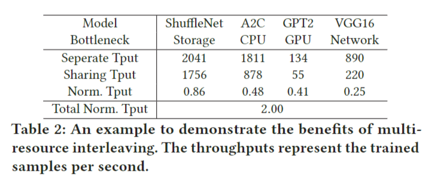
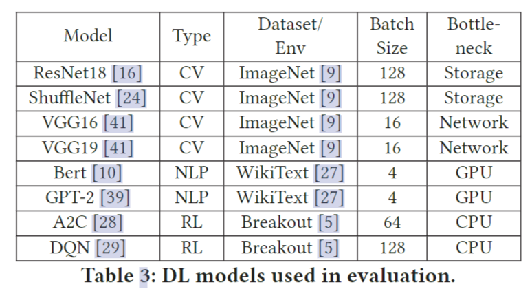
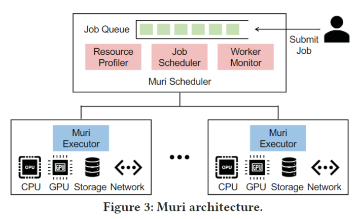

# Ⅰ. Abstract

> Training Deep Learning (DL) model requires multiple resource types, including CPUs, GPUs, storage IO, and network IO. Advancements in DL have produced a wide spectrum of models that have diverse usage patterns on different resource types. Existing DL schedulers focus on only GPU allocation, while missing the opportunity of packing jobs along multiple resource types. We present Muri, a multi-resource cluster scheduler for DL workloads. Muri exploits multi-resource interleaving of DL training jobs to achieve high resource utilization and reduce job completion time (JCT). DL jobs have a unique staged, iterative computation pattern. In contrast to multi-resource schedulers for big data workloads that pack jobs in the space dimension, Muri leverages this unique pattern to interleave jobs on the same set of resources in the time dimension. Muri adapts Blossom algorithm to find the perfect grouping plan for single-GPU jobs with two resource types, and generalizes the algorithm to handle multi-GPU jobs with more than two types. We build a prototype of Muri and integrate it with PyTorch. Experiments on a cluster with 64 GPUs demonstrate that Muri improves the average JCT by up to 3.6× and the makespan by up to 1.6× over existing DL schedulers.

训练深度学习 (DL) 模型需要多种资源类型，包括 CPU、GPU、存储 IO 和网络 IO等等。深度学习的进步催生了了大量的模型，这些模型在不同的资源类型上具有不同的使用模式。现有的DL调度器只关注GPU的分配，却错过了将作业整合到多个资源类型上的机会。

因此我们提出了 **Muri**，一种用于 DL 工作负载的多资源集群调度器。**Muri**利用DL训练作业的多资源交错来实现高资源利用率，并减少作业完成时间(JCT)。DL作业具有独特的分阶段迭代计算模式。与在空间维度上打包作业的大数据工作负载的多资源调度器不同，**Muri**利用这种独特的模式在时间维度上对同一组资源上的作业进行交错。**Muri**采用Blossom算法为**单单GPU作业**作业寻找两种资源类型的的完美分组方案，并将该算法推广到处理两种以上资源类型的**多GPU**作业。我们构建了一个**Muri**的原型，并将其与PyTorch集成。在具有64个GPU的集群上进行的实验表明，与现有的DL调度器相比，Muri将平均JCT提高了3.6倍，最大完成时间提高了1.6倍。

**CCS CONCEPTS**

- Computer systems organization → Cloud computing
- Computing methodologies → Machine learning.

# Ⅱ. Introduction

深度学习(DL)越来越多地集成到以数据为中心的互联网应用和服务中。**训练深度学习模型**已经成为数据中心的一项重要工作。企业构建 GPU 集群来运行深度学习训练作业。用户向集群提交深度学习训练作业，**集群调度程序对作业进行调度和资源分配**，提高集群效率和作业效率。

这些调度器中一个关键的潜在假设是**GPU是DL训练作业的瓶颈**，因此它们在调度作业时只需要考虑GPU，而不需要全面考虑其他资源类型。然而，在实践中，深度学习训练需要多种类型的资源，包括：

- 从本地或远程存储**读取训练数据**以供工作节点使用的存储输入/输出
- CPU 用于预处理和**模拟**（例如在强化学习中）
- GPU 用于**前向和反向传播**
- 网络输入/输出用于分布式训练中的工作节点之间的**梯度同步**

对于许多早期的DL模型(如ResNet）来说，GPU是模型训练的瓶颈——这就是为什么现有的DL调度器专注于GPU分配的原因。然而，随着近年来深度学习的快速发展，这种假设不再成立。现在各种各样的深度学习模型在模型大小和类型上变化很大。**训练不同的深度学习模型需要不同的资源**，**有时GPU并不是唯一的瓶颈资源，其他资源也可能成为深度学习工作的瓶颈**。例如，随着在物联网(IoT)场景的边缘设备中部署深度学习应用的需求不断增长，对微型深度学习模型的研究变得越来越流行。在GPU上训练一个小模型速度很快，瓶颈通常存在于存储IO身上，即从存储中读取样本的速度不够快，不足以使GPU饱和。训练强化学习(RL)模型依赖于CPU进行仿真，例如在训练机器人控制策略时模拟机器人和环境。与在GPU上执行神经网络计算相比，模拟可能需要更长的时间，这使得CPU成为瓶颈。对于大型深度学习模型的分布式训练任务，网络IO通常是瓶颈。在某些情况下，90%的训练时间花费在梯度同步的组网上。仅基于GPU调度深度学习训练作业使资源远远没有得到充分利用。

在本文中，我们提出了**Muri**，**一个用于深度学习工作负载的多资源集群调度器**，它利用多资源交错的机会来实现高资源利用率并减少深度学习工作负载的作业完成时间(JCT)。与现有的深度学习调度程序不同，在调度深度学习训练作业时，Muri利用多种资源类型来提高整体资源利用率。当训练任务培训工作在一种资源类型上遇到瓶颈时，其他类型的资源未得到充分利用，可以将它们分配给其他工作。**Muri**的核心思想是将多个在不同资源类型上出现瓶颈的作业穿插在一起，从而有效地利用资源，减少作业排队时间，从而减少JCT。

在过去，大数据工作负载(如Spark作业)的集群调度器考虑了多资源调度。然而由于大数据作业的多样性，先前的多资源调度器通常使用每种资源类型的最大使用量作为每个作业的需求，并在空间中为作业分配资源。当作业运行时，分配给作业的资源不会与其他作业共享。

我们的观察到的重点是，深度学习训练工作具有独特的分阶段迭代计算模式，可以实现细粒度的多资源交错。具体来说，深度学习训练任务由许多迭代组成，每个迭代由一系列阶段组成，如数据加载、预处理、向前和向后传播以及梯度同步。每个阶段通常高度利用一种特定的资源类型，这使得通过交叉不同作业的不同阶段，可以将多个作业打包在同一组资源上。由于采用迭代计算模式，**这样的打包决策只需要在作业级别完成，这降低了细粒度打包的调度开销，使其可行。**

Muri的主要技术挑战是在多种资源类型和多GPU作业存在的情况下最大限度地提高交错效率。对于单GPU作业的基本情况，我们将问题表述为k维最大加权匹配问题（k-dimensional maximum weighted matching problem），这个问题可以用Blossom算法来解决，找到两种资源类型的完美匹配策略。我们设计了一个基于Blossom算法的多轮算法来处理两种以上的资源类型。对于多GPU作业，一个作业可能属于不同GPU上的不同打包组，作业内部worker同步和作业间交错之间的交互会引入额外的打包开销。该算法避免了跨组封装，使封装开销最小化。

多资源交织不同于最近在深度学习训练中的**多资源流水线研究**。后者侧重于重叠同一作业的不同阶段的资源使用，例如ByteScheduler和BytePS中的重叠梯度同步(network)和前向传播(GPU)。当作业在特定资源类型上遇到瓶颈时**(例如对于通信计算比高的作业GPU利用率较低)，**或者无法完全重叠不同资源类型的使用(例如，由于数据依赖性)，资源仍然可以在作业内部流水线中得到充分利用。**Muri的关键新颖之处在于它引入了作业间的交错，从而重叠了不同作业的资源使用情况。**在调度多个作业时，Muri使用作业间交错来提高集群的整体资源利用率，从而提高makespan和JCT。

## Contributions

- 我们确定了使用多种资源类型的交叉DL训练工作的机会。

- 基于Blossom算法设计了一种新的调度算法，该算法考虑每个作业的多资源使用情况，对作业进行分组，最大限度地提高交叉效率。

- 提出了Muri，一个用于深度学习工作负载的集群调度器，它利用多资源交错。在拥有64个V100 GPU的集群上进行的实验表明，与现有的DL调度器相比，Muri将平均JCT提高了3.6倍，最大扩展时间提高了1.6倍，尾部JCT提高了3.8倍[15,25,45]。在更大的轨迹上进行轨迹驱动的模拟表明，Muri将平均JCT提高了6.1倍，最长时间提高了1.6倍，尾部JCT提高了5.4倍。

  

# Ⅱ. Motivation

## 2.1 Limitations of Existing DL Schedulers

许多深度学习调度器已经被提出用于深度学习训练工作量。已知当运行时间已知时，最短作业优先(SJF)和最短剩余时间优先(SRTF)可以最小化平均JCT，而当运行时间未知时，最小达到服务(LAS)和Gittins指数是有效的。几个深度学习调度程序扩展了这些算法，通过考虑每个作业使用的GPU数量和对分布式训练吞吐量很重要的位置偏好来调度深度学习训练作业。例如，Tiresias将SRTF、LAS和Gittins索引分别扩展为最短剩余服务优先(SRSF)、2D-LAS和2D-Gittins索引，用于深度学习作业调度。这些解决方案在作业运行时专门为作业分配GPU。

最近的一些工作探索了用于DL调度的GPU共享。当 GPU 是 DL 作业中使用的唯一资源时，这是有效的。然而，由于 DL 作业使用各种资源类型，并且不同的作业受到不同资源类型的瓶颈，仅考虑 GPU 共享甚至会降低性能。我们用一个例子来说明只考虑GPU共享的局限性。假设我们有两个作业，每个作业的运行时间为1个时间单位。**如果没有GPU共享，我们使用先进先出(FIFO)来调度这些作业。一项工作在一个时间单位内完成;另一个作业等待1个时间单元，并使用1个时间单元运行，即其JCT为2个时间单元。平均JCT为(1+2)/2 = 1.5时间单位。**假设这两个作业可以放在一个GPU中，但它们会竞争其他资源(例如存储IO)。因此，当它们并发运行时，它们的运行速度只有一半。**通过GPU共享，每个作业的JCT变成了2个时间单位。因此，平均JCT是2个时间单位，这甚至比单独运行它们更糟糕。**

## 2.2 Opportunities & Challenges

### Opportunity: multi-resource interleaving.

深度学习训练作业使用多种资源类型，并且使用模式是分阶段的。表1显示了四种流行的深度学习模型的持续时间百分比。我们在两台机器和16个V100 GPU上执行这些模型。我们使用**PyTorch Profiler**来记录每个操作符的类型、持续时间和资源类型。我们通过将每个阶段的时间除以一次迭代的持续时间来计算持续时间百分比。请注意，一个DL模型中四个阶段的持续时间百分比的总和可能不是100%，主要有两个原因。首先，一个深度学习训练任务重叠不同的阶段，以减少一次迭代的持续时间，例如重叠反向传播和梯度同步。因此，持续时间百分比的总和可能大于100%。其次，阶段之间存在一些空闲时间，例如CUDA调度器可能会延迟计算内核的执行。空闲时间增加了一次迭代的持续时间，从而导致持续时间百分比的总和变小。**分析结果证实，每个阶段主要使用一种资源类型，即存储IO用于数据加载，CPU用于预处理，GPU用于前向和后向传播，网络IO用于梯度同步。此外，表1说明了不同的DL模型在不同的资源类型上存在瓶颈，而不仅仅是GPU。**

关于资源共享有两个层面的概念，即**空间共享和时间共享**。首先，对于每种资源类型，当一个作业不能充分利用一种类型的资源时，它可以与其他作业共享该资源。一种类型的资源可以分成多个部分，每个作业拥有一个部分，即空间共享。第二，在资源类型上，DL训练任务可以相互交错，跨时间共享不同的资源，即时间共享。即使DL训练作业高度利用一种类型的资源(例如，GPU)，它也可能不会一直使用这些资源(例如，在数据加载，预处理和梯度同步期间GPU利用率较低)。**通过小心地改变作业的阶段，多个作业可以交错使用不同类型的作业。**

在大数据工作负载(如Spark作业)的集群调度中，已经研究了多资源调度。但是以前的多资源调度解决方案只能执行粗粒度调度空间中的多资源打包。由于大数据作业是多种多样的，因此在制定调度决策时，它们将每种资源类型的最大使用量作为每个作业的需求，并且不会在同一组资源上并发运行作业。

我们利用DL训练任务独特的阶段迭代计算模式，使细粒度的多资源及时交错。**图1**说明了多资源交错的好处。有四个作业，分别是A、B、C和d。该图绘制了每个作业一次迭代的资源使用情况。**这四个作业在不同的资源类型上存在瓶颈。如果将资源专门分配给它们，则每次只能运行一个作业。**当至少一种资源类型的峰值使用率很高时，多资源打包不能打包作业。它必须分别运行这四个作业，如图1(a)所示。另一方面，如图1(b)所示，通**过交错使用不同的资源类型，这四个作业可以重叠并并发运行，与单独运行它们相比，这增加了资源利用率，并将吞吐量提高了4倍。**

由于每个作业的计算都是迭代的，多资源交错的调度决策只需要在作业级别执行一次，然后作业可以使用交错计划运行多次迭代，从而降低调度开销并使这种调度策略对于具有大量作业的集群是可行的。然而，实现这个想法需要解决几个技术挑战。

### Multi-resource interleaving vs. pipelining

图1显示了一个理想的案例用于说明多资源交错的思想和好处。在实践中，深度学习训练作业采用流水线方式来重叠不同资源的使用。例如，在训练当前批(即流水线存储IO和GPU)时，通常会预取下一批的训练样本，并与正向和反向传播(即流水线网络IO和GPU)重叠梯度同步。**我们注意到现有工作中的多资源流水线和本文中的多资源交织的思想是正交的**，其中多资源流水线利用了工作内部方面而多资源交织利用作业间方面。重要的是，当作业在特定资源上遇到瓶颈时(例如，具有高通信与计算比的作业的GPU利用率较低)，或者不能完全重叠不同资源的使用(例如，由于数据依赖性)，作业内部流水线的资源仍然未得到充分利用。例如，图2(A)中作业A未充分利用网络，图2(B)中作业B未充分利用GPU。**如图2(c)所示，将作业A和作业B交叉运行，与单独运行它们相比，可以提高11/6.5 = 1.7倍的吞吐量。**

我们注意到，图2中的情况仍然是简化的，因为每种资源类型要么已使用，要么未使用。在现实中，**某些资源类型(如CPU)在整个训练过程中使用的利用率是不同的(如数据预处理时CPU利用率高，训练时CPU利用率低)**。关键的一点是，当不同的类型在不同的工作中被高度利用时，要交叉使用这些阶段。

### Example

为了展示多资源交织的潜力，我们考虑了四个训练任务，分别训练ShuffleNet、A2C、GPT2和VGG16。批大小和数据集列在**表3**中。每台机器配置8个NVIDIA Tesla V100 gpu, 2个Intel Xeon(R) Platinum 8260 cpu和一个Mellanox CX-5单端口网卡。训练数据存储在本地。训练四个任务在16个GPU上完成。这四个任务在不同的资源类型上有瓶颈:**ShuffleNet的存储IO, A2C的CPU, GPT-2的GPU, VGG16的网络IO**。表2列出了分别训练和一起训练时的吞吐量。当这四个作业在多资源交错的情况下一起运行时，我们计算标准化吞吐量，即并发运行时的吞吐量除以每个作业单独运行时的吞吐量。我们将四个作业的归一化吞吐量加起来，结果是2x，**这表明多资源交错的加速提高了2x。**它没有达到4x，因为四个作业的每次迭代时间是不同的，并且四个作业不能完全重叠在不同的阶段。然而，它展示了使用多资源交错改进作业调度的潜力。

请注意，**多资源交错并不会显著增加GPU内存的使用，因为中间数据消耗了大部分GPU内存[42]，而多资源交错会交叉这些数据的出现。**对于上面的例子，与GPT2相比，交叉四个作业只增加了GPU内存消耗的峰值<10%，GPT2消耗了四个模型中最多的GPU内存。因此，多资源交错是提高深度学习作业资源利用率的可行方法。

### Challenges for multi-resource interleaving.

实现多资源交错存在一些技术难题。首先，**阶段的重叠会影响每个阶段的处理速度**，从而影响每次迭代。因此，不同的交错模式，即何时以及以何种方式执行这些阶段，可以提供不同的加速效果。其次，我们**需要一种方法来捕捉交错一组作业的效用**，反映一个作业与一个作业的资源利用率是否比另一个作业更好。准确捕获不同作业组的交错效用对调度质量至关重要。第三，对于运行许多DL作业的集群，分组作业的组合数量呈指数级增长。基于不同组的交错效用，我们需要**决定如何对作业进行分组，以最大化集群范围的资源利用率并最小化JCT**。第四，分布式训练作业在多个gpu上运行，使情况更加复杂。**如果一个分布式的训练作业在不同的gpu上属于不同的组，则该作业的每个worker需要与不同的job交错，并且不同的worker需要相互同步。**这可能会带来额外的同步开销。

# Ⅲ. Muri Overview

**Muri**是用于DL工作负载的多资源集群调度器。它利用DL作业的多资源使用模式，实现高效的多资源共享。**Muri的核心是利用深度学习作业的分阶段迭代计算模式，在时间上以细粒度的方式在多个资源上交错进行深度学习作业。**这使得多个DL作业可以在同一组资源上并发运行，从而提高了资源利用率，减少了作业排队时间，并减少了JCT。Muri的体系结构如图3所示。

## 3.1 Muri scheduler.

用户向Muri调度程序提交DL训练任务。Muri调度器维护一个作业队列来缓冲提交的作业，并做出作业调度决策。调度程序包括三个组件，分别是**资源分析器、作业调度程序和工作监视器（resource profiler, job scheduler, and worker monitor.）**。

***资源分析器。***资源分析器分析每个作业的每种资源类型的资源使用情况，并估计不同作业组的交错效率，这将作为调度算法的输入。当作业首次提交时，作业分析器对作业进行几次演练以测量资源使用情况和执行持续时间。对于以前已提交的训练相同模型的作业，可以重用以前收集的资源配置文件，而无需重新分析。对于给定的作业组，资源分析器使用资源配置文件来估计交错效率。

***作业调度器。***作业调度器将作业从作业队列调度到集群中的机器。调度程序在作业到达和作业完成等事件时被周期性地调用。基于不同作业组的交织效率，**调度程序采用多轮作业分组算法**，决定哪些作业分组共享资源，使资源利用率最大化。该算法能够找到具有两种资源类型的单gpu作业的最优分组策略。我们扩展了该算法以处理两种以上的资源类型并支持多gpu作业。该算法避免了多gpu作业的跨组打包，以最小化交错开销。

> 多轮作业分组算法是一种用于优化和调度多个作业（通常是计算任务或工作流程）的算法。它的目标是有效地分配计算资源，以最大程度地提高系统的整体性能和资源利用率。多轮作业分组算法通常包括以下步骤：
>
> 1. 作业分类：将一组待执行的作业按照某种规则或策略进行分类或分组。这可以是根据作业的优先级、资源需求、执行时间估计等标准进行分类。
> 2. 分组形成：在根据分类结果将作业分组成小批次（或轮次）。每一轮中的作业可以被同时提交或执行。
> 3. 调度策略：对每一轮中的作业执行某种调度策略，以确定它们的执行顺序和资源分配。这可以包括按照优先级分配资源、最小化等待时间、最大化资源利用率等目标。
> 4. 执行和监控：执行每个分组中的作业，同时监控其进度和资源使用情况。
> 5. 重复：根据系统状态和作业队列的变化，反复执行前面的步骤，以不断优化和调整作业分组和资源分配。
>
> 多轮作业分组算法的主要目标是在有限的资源下有效地管理和执行作业，以最大程度地提高系统的吞吐量、降低延迟和提高资源利用率。这种算法通常应用于大规模计算集群、云计算环境、超级计算机和分布式系统等场景，以处理复杂的计算工作负载。不同的多轮作业分组算法可以根据具体的需求和系统特性进行定制和优化。

***工作节点监控器。***工作节点监控器收集每台机器的资源信息并跟踪每个作业的进展情况。资源信息包括每台机器上可用资源的容量。对于GPU集群上的深度学习工作负载，工作节点监控器还收集每台机器上GPU的数量和拓扑结构，以便调度器可以使用这些信息来安排多GPU作业。监控器在计划的作业完成时通知调度器，释放的资源可以用于队列中的作业。

## 3.2 Muri executor.

每台机器上都有一个Muri执行器。**执行器接收来自作业调度器的作业和分组策略，并根据分组策略在机器上执行作业。**执行器还向工作节点监控器报告资源利用情况和作业进展情况。一旦在训练过程中发生故障，执行器将向工作节点监控器报告故障信息并协助处理故障。

# Ⅳ. Muri Design

在本节中，我们首先讨论如何将具有两种资源类型的单GPU深度学习训练作业分组，以获得有关多资源交错的见解。然后，我们描述如何处理多GPU作业和多于两种资源类型的一般情况。

## 4.1 Insights from Single-GPU Jobs with Two Resource Types

我们首先考虑将单 GPU 作业与两种资源类型交错的基本情况。Muri 的调度算法建立在基本案例之上。

### Interleaving jobs.

我们使用**图 4** 中四个作业（A、B、C 和 D）和两个资源类型（GPU 和 CPU）的示例来展示我们如何交错 DL 作业。该图显示了每个作业一次训练迭代的资源使用情况。为了便于说明，我们假设每次作业都使用一种资源类型。矩形的长度表示作业使用特定资源类型的长度。

我们改变不同工作的阶段，让工作相互交错，例如，在图4(a)组1中，作业A的CPU阶段与作业B的GPU阶段重叠，作业A的GPU阶段依次与作业B的CPU阶段重叠。我们在不同作业的重叠阶段之后添加了一个同步屏障。以图4(b)中的组1为例。C的CPU阶段等待到A的CPU阶段结束，而不是在自己的GPU阶段之后直接执行。避免两个作业同时使用一项资源的原因是处理速度可能会因干扰而受到显著影响

### Capturing resource interleaving efficiency.

当对两个作业进行分组时，我们需要一个度量来捕获资源交错效率。根据图4中的示例，能够完全重叠作业的资源使用的分组计划比不能重叠的分组计划要好。直观地说，更好的资源交错效率意味着更少的资源空闲时间。因此，我们定义了资源交错效率 𝛾 作为一些资源不空闲的时间的一部分。
