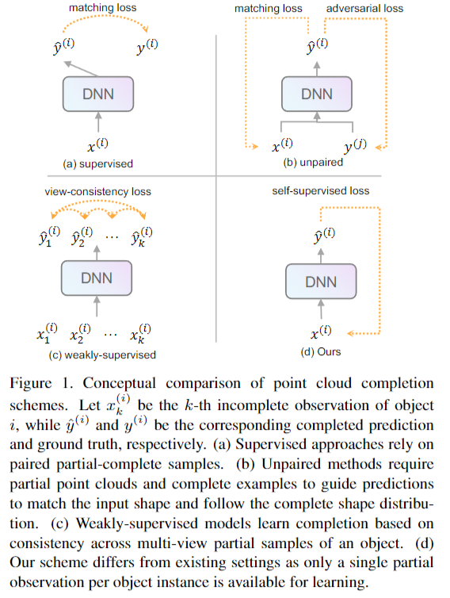

# Ⅰ. Abstract

> Point cloud completion aims to recover the complete shape based on a partial observation. Existing methods require either complete point clouds or multiple partial observations of the same object for learning. In contrast to previous approaches, we present Partial2Complete (P2C), the first self-supervised framework that completes point cloud objects using training samples consisting of only a single incomplete point cloud per object. Specifically, our framework groups incomplete point clouds into local patches as input and predicts masked patches by learning prior information from different partial objects. We also propose Region-Aware Chamfer Distance to regularize shape mismatch without limiting completion capability, and devise the Normal Consistency Constraint to incorporate a local planarity assumption, encouraging the recovered shape surface to be continuous and complete. In this way, P2C no longer needs multiple observations or complete point clouds as ground truth. Instead, structural cues are learned from a category-specific dataset to complete partial point clouds of objects. We demonstrate the effectiveness of our approach on both synthetic ShapeNet data and real-world ScanNet data, showing that P2C produces comparable results to methods trained with complete shapes, and outperforms methods learned with multiple partial observations. Code is available at https://github.com/CuiRuikai/Partial2Complete.

文章提出了 Partial2Complete (P2C)，这是第一个使用仅包含每个对象的单个不完整点云的训练样本来完成点云对象的自监督框架。框架将不完整的点云分组为局部patch作为输入，并通过学习来自不同部分对象的先验信息来预测mask patch。我们在不降低补全能力的情况下，提出了区域感知倒角距离来规范形状不匹配，并设计了法线一致性约束来纳入局部平面性假设，来鼓励恢复的形状表面是连续的和完整的。

# Ⅱ. Contributions

文章提出了一种新的自监督PCC方法，其中对于训练，我们只需要每个对象的一个视角观测。这种新颖的设置为补全提供了几个好处：

1)它消除了对完整样本的需求，从而降低了注释的难度和费用;

2)即使只有一个视角，也可以很容易地从现实世界中收集到部分物体，极大地扩展了训练数据的范围;

3)利用未知的不完备性假设，可以将部分样本、完整形状和弱监督线索统一到学习框架中，提高补全质量。图1显示了我们建议的设置与现有主要方案的不同之处。

